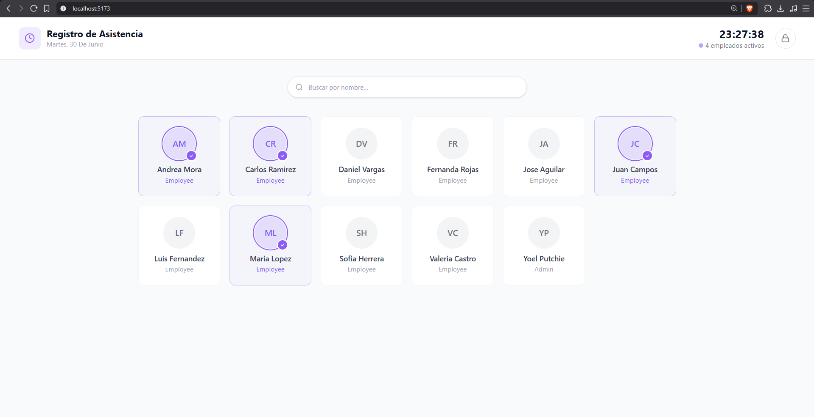
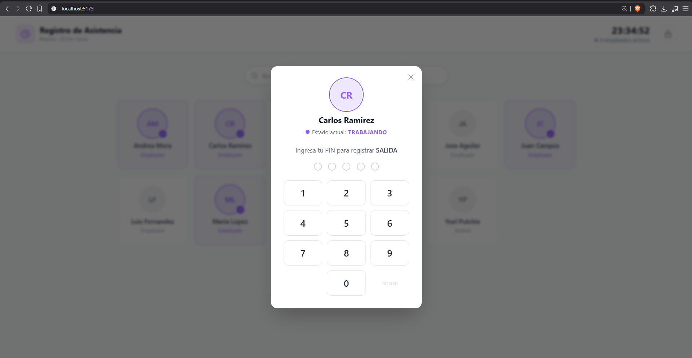

# Attendance System

A simple clock in / clock out system. The idea came from noticing a real problem at a small business that has no way to track employee attendance — working hours are currently calculated by hand. This project isn't affiliated with or commissioned by that business; it's a personal project inspired by that situation.

The goal is to let employees register their clock in and clock out with a PIN, and give admins a dashboard where they can see, for every employee, when they clocked in, when they clocked out, and the total hours worked calculated from those records — no more manual tracking.

## Features

- **Clock in / clock out** — employees authenticate with a PIN and register their attendance with a single action; the system automatically figures out whether it's an "IN" or an "OUT" based on their last record.
- **Admin dashboard** — view all attendance records (employee, date, time in/out) and see hours worked.
- **Live working status** — see at a glance which employees are currently clocked in.
- **User management** — admins can create, update, list, and delete user accounts.
- **Role management** — admins can create and manage roles (e.g. Admin, Employee).
- **Theme customization** — the app's appearance can be personalized/switched between themes from the settings panel.
- **JWT authentication** — admin routes are protected with token-based authentication.

## Tech Stack

- **Node.js** + **Express** — REST API
- **MySQL** — database
- **jsonwebtoken** — authentication
- Layered architecture: routes → controllers → services → repositories


## Getting Started

### Prerequisites

- Node.js >= 22.5.0

### Installation (Execute in Backend & FrontEnd)

```bash
npm install
```

### Run the system (Execute in Backend & FrontEnd)

```bash
npm run dev    # development, with nodemon
npm start      # production
```

## Preview

<!-- Add a screenshot of the app below -->




## Status

This project is under active development.
